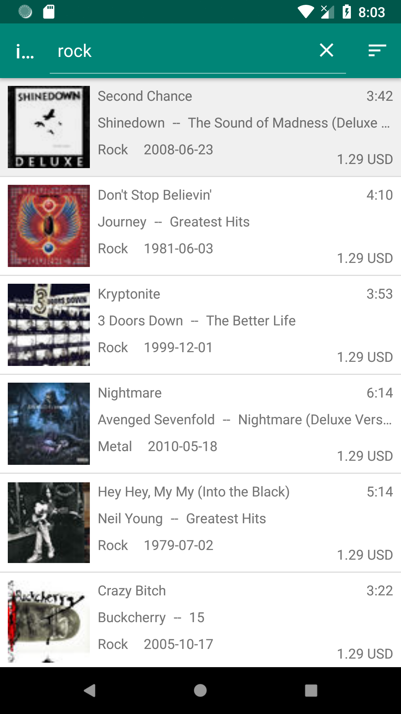
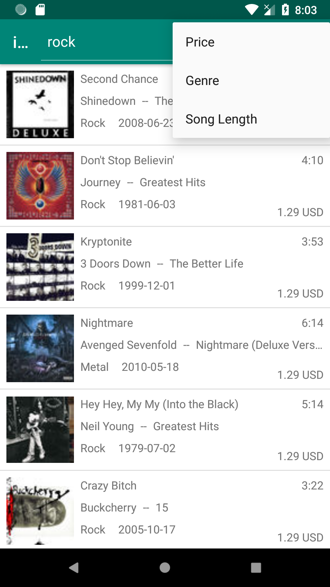
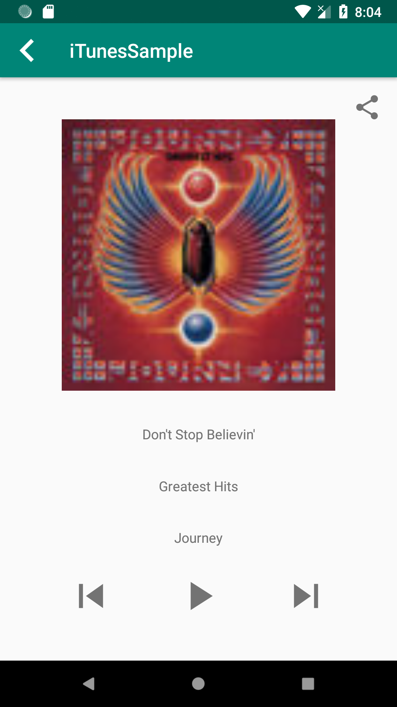

# iTunesSample Repo

I've used a simplified version of Clean architecture with MVP in the presentation layer.
With this all the components are easily replaceable / modifyable separately.
Used libraries are : dagger2 , rxjava2 , annotatedadapter, glide and butterknife.
UI and the key point of the business logic is tested separately.
I've tried to focus on the code's cleanness rather than polishing the UI.

For the api call: I'm using a special parameter to restrict the results to be only songs.

Screenshots:

 

